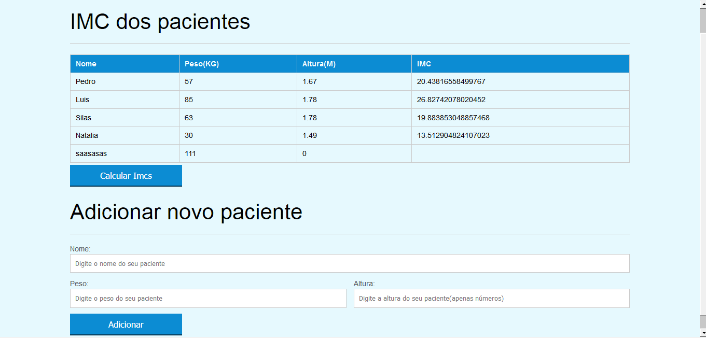

# IMC CADASTRO DE PACIENTES

Projeto desenvolvido durante o curso JavaScript. Programando na linguagem da web do ALURA.

Implementado uma validação básica nos inputs para digitação correta dos dados, feita com jquery mask

